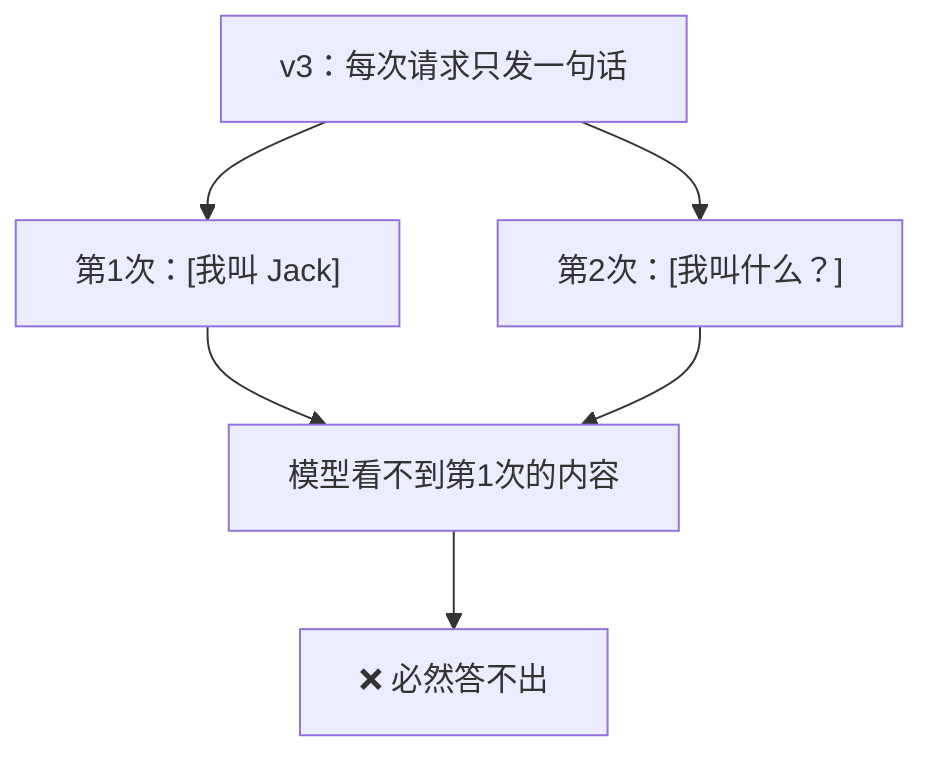
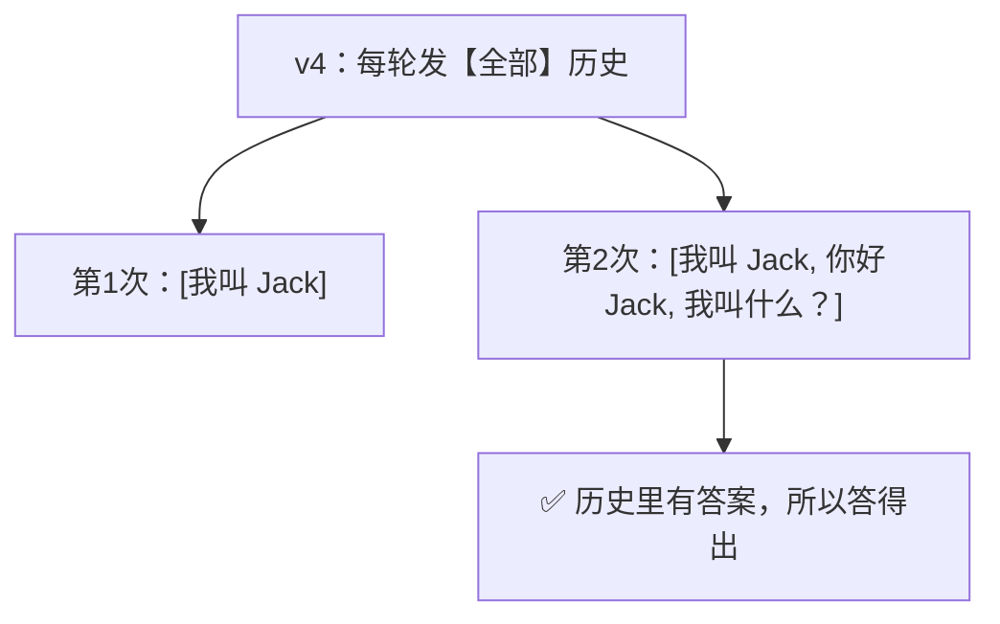

# Day 1 · 手敲练习：v1 → v4

> 目的：用 **四个递进的小文件**，亲手走完「调用 → 流式 → 循环 → 记忆」。
>
> **和 `llm_client.py` 的关系**：那 200 行是工程级封装，Day 1 不用看。
> 这里四个版本加起来不到 200 行，全部只讲「为什么」。
> 等 Day 2 你有了体感，再回去看 `llm_client.py`，会发现每行都能理解。

---

## 四个版本一览

| 版本 | 文件 | 新增的概念 | 行数 |
| --- | --- | --- | --- |
| v1 | `my_chat_v1.py` | 最小调用（一次 HTTP 请求） | ~30 |
| v2 | `my_chat_v2.py` | `stream=True` 流式输出 | ~40 |
| v3 | `my_chat_v3.py` | `while` 循环连续对话 | ~50 |
| v4 | `my_chat_v4.py` | ⭐ `messages` 列表 = 上下文记忆 | ~60 |

**每一版都是完整可独立运行的**，不是 diff。这样你能一版一版跑，对比差异。

---

## 怎么敲

```
① 先跑一遍 v1，看到回答
② 关掉 v1，自己默写一遍 v1（不看我的代码）
③ 卡住了再打开对照
④ 写出来能跑 → 进入 v2，重复
```

**为什么强调"默写"？**
`my_chat_v4.py` 的核心只有 3 行（`messages.append` ×2 + 传 `messages`）。
如果你能默写出来，说明真的懂了；只读过一遍的话，明天就忘。

---

## 运行方式

```powershell
cd "F:\笔记\AI-学习\ai-agent-learning"

uv run python day01_llm_basics\my_chat_v1.py
uv run python day01_llm_basics\my_chat_v2.py
uv run python day01_llm_basics\my_chat_v3.py
uv run python day01_llm_basics\my_chat_v4.py
```

> v3 / v4 需要交互输入，**请直接在终端手敲**（不要用管道 `|`，
> PowerShell 5.1 的管道会把中文变成 `?`）。

---

## 每版的验收标准

### v1 · 最小调用

```
□ 能打印出 DeepSeek 的回答
□ 能说出这 6 个东西分别干什么：
    load_dotenv() / OpenAI() / .create() / model= / messages= / .choices[0].message.content
```

### v2 · 流式输出

```
□ 文字是【逐字蹦出来】，不是卡几秒后整段出现
□ 能说出流式与非流式的字段差异：message → delta
□ 能解释为什么必须写 flush=True
```

### v3 · 连续对话

```
□ 能连续问多个问题，输入 exit 能退出
□ ⚠️ 问它"我叫什么"它答不出来 —— 记住这个现象，v4 要解决它
```

### v4 · 上下文记忆 ⭐

```
□ 说"我叫 Jack" → 再问"我叫什么" → 它答"你叫 Jack"
□ 能说出这 3 行是核心：
    messages.append({"role": "user", ...})
    create(messages=messages)
    messages.append({"role": "assistant", ...})
□ ⭐ 能用一句话解释：为什么模型"记住"了？
    答案不是"模型有记忆"，而是 ______________
```

---

## ⭐ 核心认知（v3 → v4 的落差）

v3 里你会遇到：

```
你：我叫 Jack
AI：你好 Jack！
你：我叫什么？
AI：抱歉，我不知道你叫什么。      ← ⚠️ 它忘了！
```

**这不是 bug，是本质。** 大模型 API 是**无状态**的：



v4 的解法不是给模型加记忆，而是**应用层每轮都把历史重发一遍**：



> **结论（请写进你的笔记）**：
> Memory 不是模型的能力，是**应用层的行为**。
> 这就是后面 Agent Memory / RAG / 上下文工程的第一块砖。

---

## 与 `chat.py` 的关系

你敲完 v4，再看我写的 `chat.py`，会发现多出来的只是「工程装饰」：

| v4 有 | `chat.py` 多加的 | 属于 |
| --- | --- | --- |
| 调 API | — | ✅ 你今天学的 |
| `messages` 记忆 | — | ✅ 你今天学的 |
| — | `argparse` 命令行参数 | Day 2+ |
| — | 错误翻译成中文提示 | Day 2+ |
| — | `/clear` `/history` 命令 | Day 2+ |
| — | 请求失败回滚 `messages.pop()` | Day 2+ |
| — | token 用量统计 | Day 7 |

**核心（少不掉的）就是 v4。其余都是装饰。**
